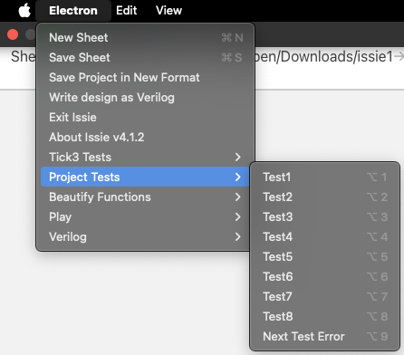
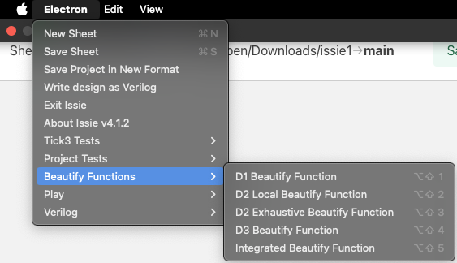
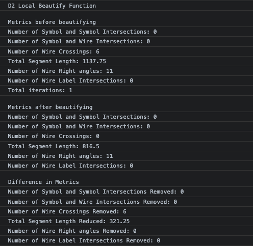

# README-HLP24-$TMF

This document provides information about the functionality and use of the beautify function for the HLP24 project by $TMF.

## Table of Contents
- [README-HLP24-$TMF](#readme-hlp24-tmf)
  - [Table of Contents](#table-of-contents)
  - [Project Wiki Link](#project-wiki-link)
  - [Testing Circuits](#testing-circuits)
  - [Beautify Functions Usage](#beautify-functions-usage)
  - [Code Modules](#code-modules)
  - [Changes Since Demo](#changes-since-demo)
  - [Additional Functionality Considerations](#additional-functionality-considerations)
  - [Rationale for Source File Modifications](#rationale-for-source-file-modifications)

## Project Wiki Link
For a detailed report and documentation of the project, refer to the project [Wiki Page](https://github.com/ben-marconi/HLP-project/wiki).

## Testing Circuits
Testing circuits can be invoked as follows:
1. On the file menu, press `Electron`->`Testing Circuits` and click on the desired Test Circuit. The options are shown below.

2. Alternatively, you can use the shortcut `Alt+n` to run a given Test Function. 
3. To go to the next test sample, press `Alt+9`. 
   
There are 8 total testing circuits each targeted towards a specific beautify function:
1. D1: Test1 and Test2
2. D2: Test3 to Test6
3. D3: Test7
4. D4: Test8

More in depth circuit descriptions are available in the [wiki](https://github.com/ben-marconi/HLP-project/wiki).

## Beautify Functions Usage
The beautify functions are invoked as follows: 
1. On the file menu, press `Electron`->`Beautify Functions` and click on the desired Beautify Function. The options are shown below.

2. Alternatively, you can use the shortcut `Alt+Shift+n` to run a given Beautify Function

When running a beautify function the console will print the following:
1. Metrics of the current sheet before beautifying.
2. Metrics of the sheet after beautifying.
3. The difference in metrics that the beautification caused.

The following is an example:

## Code Modules
The code for the beautify function is contained within the following module: 
- [SheetBeautify.fs](./src/Renderer/DrawBlock/SheetBeautify.fs)

The testing code is contained within the following module: 
- [TestDrawBlockProject.fs](./src/Renderer/TestDrawBlockProject.fs)

## Changes Since Demo
(If applicable) Since the demonstration, the following changes have been made to the repository:
- Improved D1 sheetAlign function to include a threshold to decide whether to beautify or not beautify current model to remove wire overlaps with symbols.
- Added an exhaustive component tester in `test 3` for D1 sheetAlign to check if it works on multiple different components with little space.
- The integrated beautify function includes sheetAlign at the end to remove any wire bends.

## Additional Functionality Considerations
(If applicable) It is important to consider the following aspects of functionality that were not shown during the demo:

## Rationale for Source File Modifications
One source file was changed: [SymbolResizeHelpers.fs](./src/Renderer/DrawBlock/SymbolResizeHelpers.fs). This was to fix an issue with the rendering of the bounding box when flipping Muxes. [Click Here](https://github.com/ben-marconi/HLP-project/commit/3f85db48355a4a710e57f126877db89d8a50a223) to see the changes.
