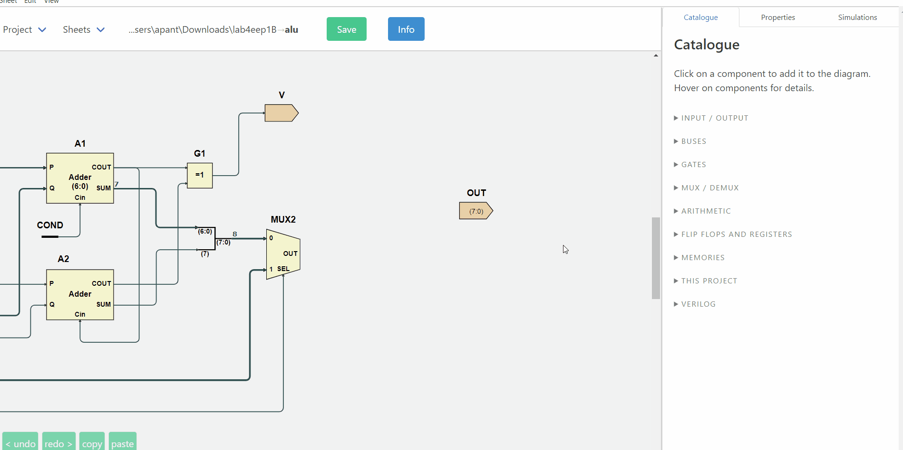
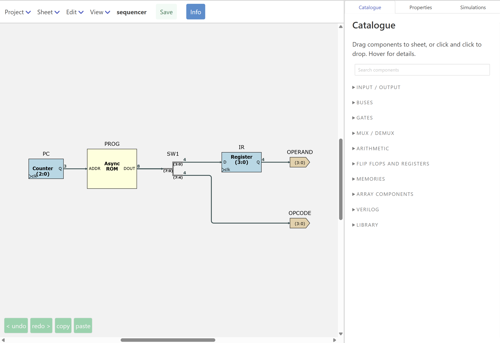
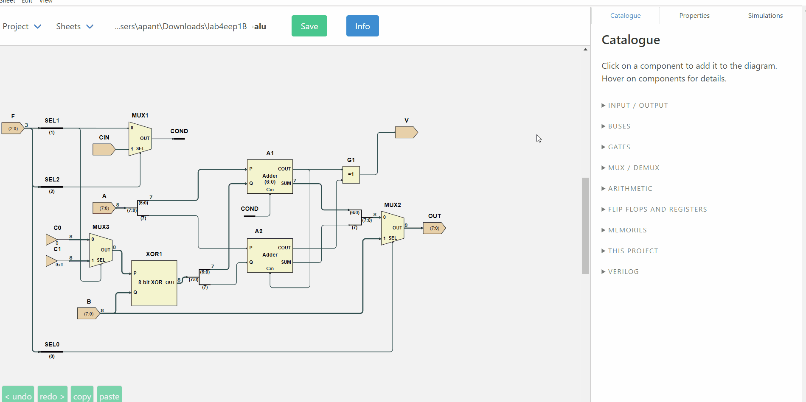
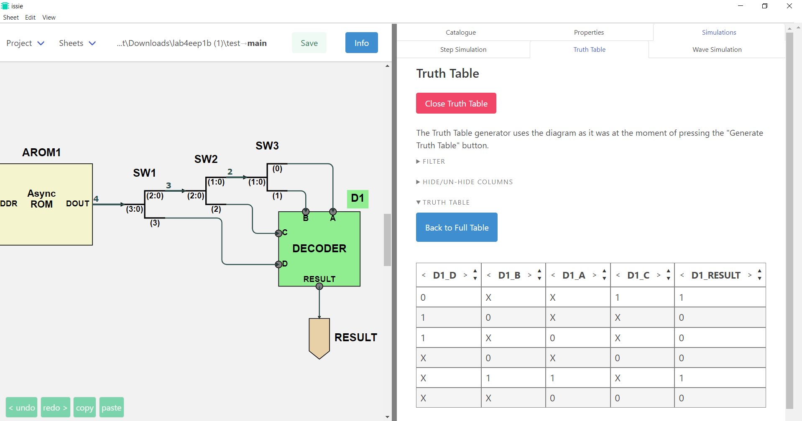
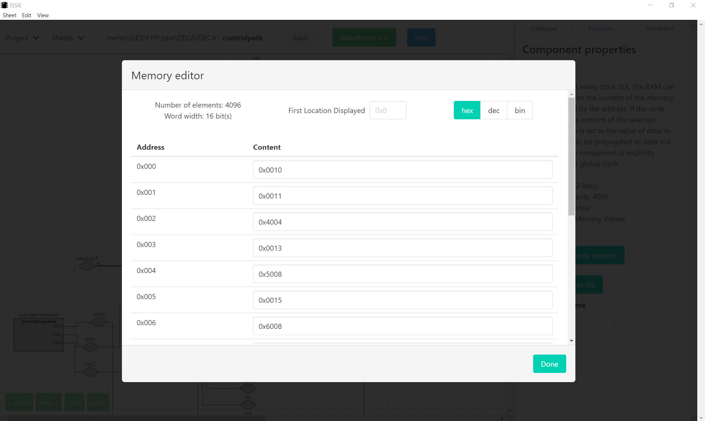
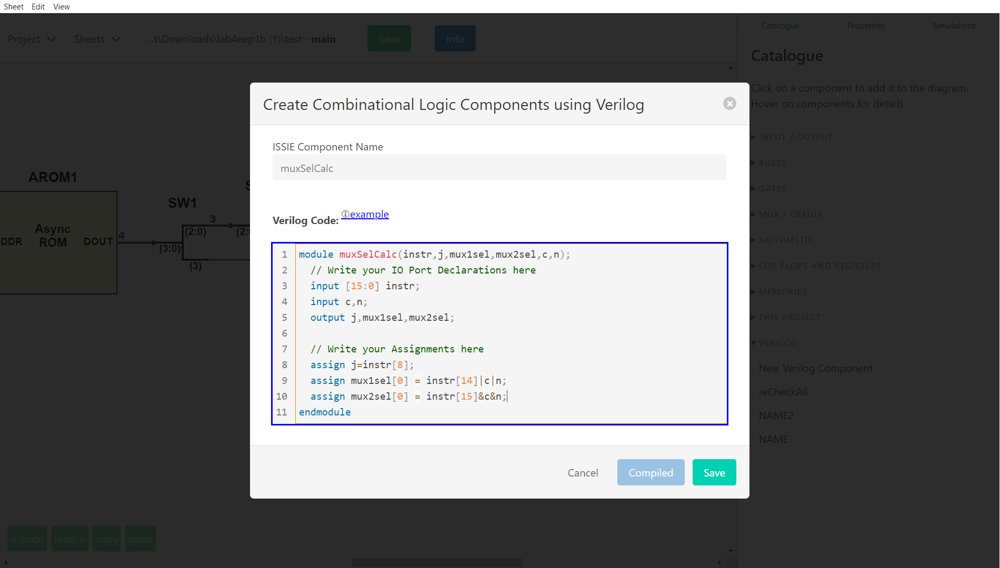

# Digital design that explains itself

**ISSIE is a free, cross-platform EDA tool for digital logic: draw a schematic, simulate it, and
see the waveforms — without reading a manual first.**

Industry CAD systems are powerful and complex to learn. Educational tools are teachable and can't scale.
ISSIE is built on the belief that this is a false choice: a tool can be learnable in the first ten
minutes *and* still be used to design and simulate large designs. The features
below make Issie intuitive to use for a novice, and efficient to use on large designs.

---

## No manual needed

|  |  |
| :--- | :--- |
| **Everything is tooltipped** | Every component in the Catalogue explains what it does when you hover it. Every field in the Properties pane explains itself the same way. |
| **Search for what you mean** | The Catalogue's search box matches the explanations as well as the names, so "subtract" finds the N bits XOR and "invert" finds Not — you do not have to already know Issies's terminology. |
| **Right-click anywhere** | Components, custom components, wires, the canvas, sheet names in the tree, even the project path — each offers exactly the actions that make sense there, with their keyboard shortcuts written on the item. |
| **The help is generated from the code** | The Keyboard Shortcuts table in **Info** is built from the same table the key dispatcher reads, for *your* platform. It cannot list a key that does not work, or miss one that does. |
| **Help where you are** | The waveform simulator has its own **Getting Started** and **Instructions** panels, and the wave selector, RAM selector and parameter dialogs all have in-app help. |
| **Drag or click** | Drag a component from the Catalogue and drop it where you want it, or just click it and click the canvas. A drop onto an occupied space is refused rather than silently overlapping two symbols. |
| **Demos to take apart** | Five worked projects ship with ISSIE, from a full adder to an EEP1 CPU running a sieve of Eratosthenes. They reset each time you open them, so you can break them freely. |

---

## Errors tell you how to fix them

This is Issie's core design principle. Issie helps you by correcting your mistakes. Invalid inputs tell you what is wrong, as soon as possible. 
A design will either simulate correctly, or tell you specifically what you need to change to make this happen.

**The error is shown on the schematic.** Every simulation error carries the components and
connections responsible, and they are highlighted on the canvas the moment the error appears — you
are not left hunting.

**The message says what to do.** Compare a typical CAD "width mismatch" with what ISSIE says:

| What went wrong | What ISSIE tells you |
| :--- | :--- |
| Bus widths disagree | *Wrong wire width. Target port expects a 4-bit signal, but source port produces an 8-bit signal.* |
| Two wires into one input | *A component input port must have precisely one driving component, but 2 were found. If you want to merge wires together use a MergeWires component, not direct connection.* |
| Two net labels wired together | *You can't connect two Net Labels with a wire. Delete the connecting wire. If you want to join two net labels you need only give them the same name — then they will form a single net.* |
| A net with two drivers | *A set of labelled wires must have precisely one driving component, but 2 were found. If you are driving two labels from the same component delete one of them: a set of labels with the same name are all connected together and only one label in each same-name set must be driven.* |
| A `.ram` file that will not parse | *Line 7: 'ff ff ff' has 3 items: valid lines consist of two numbers* |

**And often, a button that does it for you.** Where the fix is unambiguous, ISSIE offers it:

- *Fix by adding 'Not Connected' component* — and it is placed, correctly oriented, next to the
  unconnected port.
- *Fix by deleting the port on the component* — for an adder carry-out or a counter enable you
  never wired.
- *Fix by deleting unnecessary 'Not Connected' components* — the inverse, when the port could
  simply be removed.

Pressing the button applies the fix **and restarts the simulation**, so the loop closes.

**The same care outside simulation.** Sheet names, labels, bus widths and parameter values are
validated as you type, with the reason shown next to the box, and the OK button stays disabled
until the value is legal. Parameter constraints carry *author-written* error text, so a library
component can say *"address width must be at least 2 or the register file has one entry"* in its
own words. Verilog components are compiled as you type, and the Save button unlocks only when the
code is good.

---

## A schematic editor that lays out for you

- **Connect component ports** immediately by dragging a wire. Invalid wires are immediately rejected.
- **Auto-routing you almost never override.** Wires route themselves around symbols, and then a
  whole-sheet separation pass spreads every wire on the sheet evenly. Any segment can still be
  dragged and fixed by hand, and everything else reroutes around it.
- **Snapping and alignment.** Symbols snap to each other's edges and to the positions that make
  wires straight. Selections can be aligned or distributed with one key.
- **Rotate, flip, scale — individually or as a block.** Select a group and rotate or scale the
  whole thing with on-canvas handles.
- **Custom components resize themselves** around their port labels. You can use the right-click menu
  items on a custom component to drag any port to any edge to make a more readable symbol, 
  or drag the corners to size it.
- **`Ctrl-0` fits the sheet to the window** — the most-pressed key in ISSIE. `Ctrl` with `+` `-` `0`
  zooms whatever you are looking at, the schematic or the waveforms; add `Alt` for the whole
  application. `Space`-drag or `Shift`-drag pans.
- **Three wire styles, three themes, optional grid and direction arrows** — all switchable at any
  time without touching the design.
- **Long undo and redo stacks that work.**
- **Zoom the canvas or the whole of Issie**. Issie works best with a laptop FHD or better screen, but it is responsive
  and it can be used in a much smaller window. Zoom the drawing canvas and the Issie UI separately. Use trackpad gestures
  to pan and zoom the canvas if you dont like mice!

Around 40 component types, all width-agnostic where it makes sense: N-input gates (N up to 19),
N-bit adders, shifters, registers and counters with optional enable/load ports, 2/4/8-way
multiplexers, bus merge/split of up to 19 branches, bus select and compare, net labels, and
synchronous and asynchronous ROM and RAM.

---

## Three ways to simulate

### Step simulation — immediate feedback

Set inputs, read outputs, step the clock. Viewer components expose internal signals from *any*
subsheet without rewiring, values display in the radix you choose, and *set default inputs*
remembers a set of input values for both simulators.

### Truth tables — for the combinational logic

Generate a truth table for the whole sheet **or for just the components you select**. Then reduce
it: hide columns, constrain inputs to the cases you care about, remove redundant rows, or switch
inputs to **algebraic** variables and get a symbolic expression for each output instead of 2ⁿ rows.

### The waveform simulator — sophisticated, and easy to use

This is a part of ISSIE often described as better than the professional equivalent for sophisticated designs.
It is also simple and intuitive for and novices.

| | |
| :--- | :--- |
| **Something to look at straight away** | Press Start and the top sheet's own inputs and outputs are already there — or, for a design whose top sheet is all subsystems, every Viewer in it. No empty grid, and nothing to configure before you can see your design running. |
| **Any signal, any sheet** | The viewer sees the whole hierarchy, not just the top sheet. |
| **Find waves by typing** | Search by wave, sheet, component or port name, with a breadcrumb of the design hierarchy to filter by sheet — or expand the tree and browse. |
| **Add waves from the schematic** | Right-click a component on the canvas → *Add waveforms to viewer*. |
| **Hover a name, see the component** | Hovering a waveform name highlights that component and its connections on the schematic; a button beside the name jumps to the sheet it lives on and shows it. |
| **Probe the schematic** | The other direction: rest the mouse on any wire of the schematic and its value at the cursor cycle appears beside the pointer. No hunting for the signal by name. It works in step simulation too, at the current clock tick. |
| **Reorder waves by dragging, delete with one click** | And your selection survives into the next simulation. |
| **A cursor that reads values** | Click a waveform to move the cursor; the column on the right shows every selected signal's value at that cycle. Left/Right arrows step it. |
| **Scroll to simulate further** | All results are remembered. Scroll the whole simulation instantly. Drag the scrollbar past the end and the simulation extends itself. Waveforms are generated on demand, so only what you look at is drawn. |
| **RAM contents live** | *Select RAM* shows a memory's contents at the cursor cycle, with the locations being read and written marked — and any comments from the `.ram` file that initialised it shown against their addresses. |
| **Zoom, and sample-zoom** | Ordinary zoom for detail; a sampling multiplier for viewing hundreds of thousands of cycles at once. |
| **Bin / Hex / uDec / sDec** | Switch radix at any time; values too wide to fit are shown in the cursor column instead. |
| **Edit while simulating** | Change the design — even move to another sheet and edit it — and a green **Refresh** button lights up. Press it when you are ready and you see immediately the chnage in the waveforms and clock cycles you are looking at. |
| **Configurable** | Font size and weight for readability; maximum number of simulated cycles with a live estimate of the memory that will cost. |

### Performance

ISSIE has its own simulator, every few years we rework this for higher performance. 

- The first version of Issie would simulate a RISC CPU at 10 cycles per second. Issie will now simulate 100,000 cycles of the same CPU in one second. We hope for another 10X speedup over the next few years but we are now getting close to the fundamental limits.
- Issie will make good use of all the memory on your laptop to simulate very large designs. We have recently refactored the simulation for better memory
  performance.  Currently we can simulate designs 100X larger than a typical simple RISC CPU. We expect a further 10X improvement (space efficiency has not been a priority) over the next year.

---

## Designs that scale

**Hierarchy.** Any design sheet can be used as a custom component in another, any number of times.
The **Sheet** menu draws the whole project hierarchy as a tree with connector lines, showing which sheet
contains which, and the same tree appears in the waveform simulator to guide selection of waveforms.

**Sheet parameters.** Declare named integer parameters on a sheet — `WIDTH`, `DEPTH` — and use
arithmetic expressions in them for bus widths, constants, memory sizes and split points. Each place
the sheet is used gives its own values, so **two instances of one sheet can legitimately differ**,
and ISSIE tracks each instance against *its own* bindings. 

**Extend with user-writable component libraries.** Ready-made parameterised components can be written as Issie designs with parameters
and then used exactly as built-in components. Issie can be extended keeping the same simple interface
for users. Library components can contain multiple sheets - for example CPUs.

**Memory files.** RAM and ROM contents can be edited in a table or initialised from a `.ram` text
file, which may carry `//` comments — ISSIE shows them against the locations they describe, so a
program in memory is readable.

**Never lose work.** Every sheet is continuously snapshotted to a `backup/` folder inside the
project.

---

## Verilog, in and out

**In:** write a component's logic in SystemVerilog instead of drawing it — combinational
(`assign`, `always_comb`) and synchronous (`always_ff @(posedge clk)`), with parameters, arrays,
`if`/`case`/`for`. The editor highlights syntax, checks as you type, refuses to save until the code
compiles, and offers one-click fixes for many errors. The result is compiled to an ordinary ISSIE
sheet, so it simulates exactly like the equivalent schematic. See
[Verilog Components](verilogComp.html).

**Out:** write any sheet and everything below it as synthesisable Verilog from its right-click menu,
for an FPGA toolchain. See [Verilog Output](verilogGenerate.html). An integrated build flow for
[ISSIE-Stick](issiestick.html) hardware also exists, from an earlier project, but is no longer
maintained.

---

## Practical matters

- **Free and open source**, on [GitHub](https://github.com/tomcl/issie) under the
  [GNU GPL v3 or later](https://github.com/tomcl/issie/blob/master/LICENSE.md).
- **Windows, macOS (Apple Silicon) and Linux.** No installation and no system changes: unzip and
  run. About 200 MB.
- **Your files are yours.** One human-readable JSON file per sheet, in a folder you choose. No
  cloud, no account, no telemetry.
- **Actively developed and used in teaching at Imperial College London**, by staff and undergraduates,
  since 2020.

 

**[Get ISSIE](gettingStarted.html)** · **[One-page tutorial](userGuide.html)** ·
**[Editor feature reference](coolFeatures.html)**
