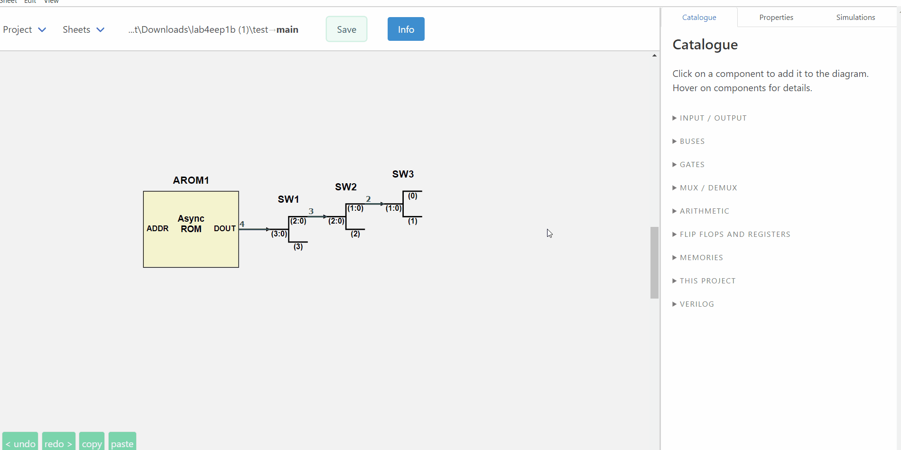
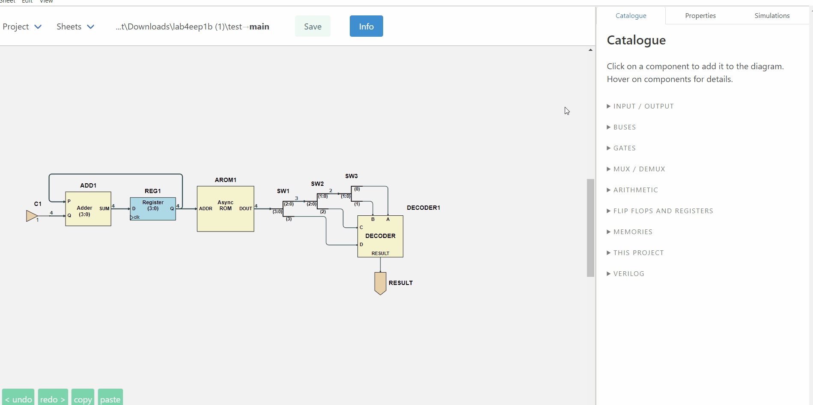

# Digital design that explains itself

**ISSIE is a free, cross-platform editor and simulator for digital logic: draw a schematic,
simulate it, and see the waveforms — without reading a manual first.**

<!--
  Written as HTML rather than markdown: FSharp.Formatting mis-parses a bold link
  at the start of a paragraph - `**[text](url)**` comes out as `*<em>text</em>*`.
-->

<strong><a href="https://github.com/tomcl/issie/releases/latest">Download ISSIE</a></strong>
&mdash; Windows, macOS and Linux, x64 and Arm64. Unzip and run; no installation, no account.

<strong><a href="userGuide.html">Follow the one-page tutorial</a></strong>
&mdash; from an AND gate to a clocked design with waveforms, in one sitting.

<strong><a href="features.html">See everything it does</a></strong>
&mdash; the full feature reference.

## Why ISSIE exists

Industry CAD systems are powerful and complex to learn. Educational tools are teachable and don't
scale. ISSIE is built on the belief that this is a false choice: a tool can be learnable in the
first ten minutes *and* still be used to design and simulate large designs.

It is developed by staff and undergraduates at Imperial College London, and has been used to teach
first-year digital electronics since 2020.

## Errors tell you how to fix them

This is ISSIE's core design principle, and the clearest thing that sets it apart. Every error names
what is wrong, highlights the components and connections responsible on the schematic, and says
what to do about it:

| What went wrong | What ISSIE tells you |
| :--- | :--- |
| Bus widths disagree | *Wrong wire width. Target port expects a 4-bit signal, but source port produces an 8-bit signal.* |
| Two wires into one input | *A component input port must have precisely one driving component, but 2 were found. If you want to merge wires together use a MergeWires component, not direct connection.* |
| A `.ram` file that will not parse | *Line 7: 'ff ff ff' has 3 items: valid lines consist of two numbers* |

Where the fix is unambiguous, ISSIE offers a button that applies it **and restarts the
simulation**, so the loop closes. [More on how errors are handled](features.html#Errors-tell-you-how-to-fix-them).

## No manual needed

Every component in the Catalogue and every field in the Properties pane explains itself when you
hover it. The Catalogue's search box matches those explanations as well as the names, so "subtract"
finds the N bits XOR. Right-click anything — a component, a wire, the canvas, a sheet in the tree —
and you get exactly the actions that apply there, each labelled with its keyboard shortcut. The
shortcut table in **Info** is generated from the table the key dispatcher reads, for your platform,
so it cannot list a key that does not work.

Five worked demo projects ship with ISSIE, from a full adder to an EEP1 CPU running a sieve of
Eratosthenes. They reset every time you open them, so you can take them apart freely.

## Three ways to simulate

- **Step simulation** — set inputs, read outputs, step the clock, with values in the radix you choose.
- **Truth tables** — for a whole sheet or just the components you select, reducible by hiding
  columns, constraining inputs, or switching inputs to algebraic variables to get a symbolic
  expression instead of 2ⁿ rows.
- **The waveform simulator** — the whole design hierarchy, not just the top sheet; search for
  signals by name, add them by right-clicking the schematic, read values at a cursor, and scroll
  past the end to extend the simulation. Rest the mouse on any wire of the schematic and its value
  at the cursor cycle appears beside the pointer.

ISSIE has its own simulator. The first version simulated a RISC CPU at 10 cycles per second; it now
runs 100,000 cycles of the same CPU in about a second.

## Designs that scale

Any sheet can be used as a custom component inside another, any number of times, and the **Sheet**
menu draws the whole project as a tree. Sheets can take **integer parameters** — `WIDTH`, `DEPTH` —
used in arithmetic expressions for bus widths, constants and memory sizes, with each use of the
sheet supplying its own values, so two instances of one sheet can legitimately differ. Ready-made
parameterised components can be written as ordinary ISSIE designs and shared as
**component libraries**.

A design can be written out as synthesisable Verilog for your own FPGA toolchain, and a component's
logic can be written *in* SystemVerilog instead of drawn.

## Practical matters

- **Free and open source**, on [GitHub](https://github.com/tomcl/issie) under the
  [GNU GPL v3 or later](https://github.com/tomcl/issie/blob/master/LICENSE.md).
- **Windows, macOS and Linux**, each built for x64 and Arm64. No installation and no system
  changes: unzip and run. About 200 MB.
- **Your files are yours.** One human-readable JSON file per sheet, in a folder you choose. No
  cloud, no account, no telemetry. Every sheet is continuously backed up inside the project.
- **Actively developed.** Every release and what changed in it is on the
  [releases page](https://github.com/tomcl/issie/releases).

 

<strong><a href="gettingStarted.html">Get ISSIE</a></strong> &middot;
<strong><a href="userGuide.html">One-page tutorial</a></strong> &middot;
<strong><a href="features.html">Full feature reference</a></strong> &middot;
<strong><a href="coolFeatures.html">Editor operations</a></strong> &middot;
<strong><a href="about.html">About the project</a></strong>

