## Getting Started

### Downloading and Running ISSIE

Find the [latest ISSIE release](https://github.com/tomcl/issie/releases/latest). At the bottom of the page, under `Assets`, you can find the latest pre-built binary for your platform: Windows, MacOS and Linux are all built, each for x64 and Arm64. ISSIE will require in total about 200M of disk space.

- **Windows:** unzip \*.zip anywhere and double-click the top-level `Issie.exe` application in the unzipped files.
- **MacOS:** Double click the dmg file  and run the application inside the folder, or drag and drop this to install.
    - The MacOs binaries are signed. 
- **Linux:** unzip \*.zip anywhere and run the `issie` executable in the unzipped files.
- **If you can't find a binary**: 
   - MacOs binaries are sometimes not uptodate. You can always generate your only binary by 
[setting up for development](https://github.com/tomcl/ISSIE#getting-started-as-developer) and running `npm run dist`. This will not need to be signed if runnng on your own machine. Note that you do not need to edit source code to generate a binary.
   - You can look through previous releases to find the last posted binary for your system. However ISSIE newer releases often have significant new functionality and bug fixes. It is best to have the latest release,
    

### Creating a New Project

When ISSIE opens with no project it offers `New project`, `Open project` and `Open demo project`,
followed by any projects you have opened before.

- Click `New project`
- ISSIE shows its own project browser: pick the folder you want the project to live in, walking
  into folders from the list or using `Browse` for somewhere it does not reach. Recently used
  projects are listed down the left.
- Enter the name of your project
- Click `Create Project`

This process creates a folder where your project will be stored and the first sheet of your
project, called `main`. You can see this by opening the **Sheet** menu, which draws every sheet in
the project as a tree showing which sheet uses which.

If you would rather look around first, `Open demo project` offers five worked designs — from a full
adder up to a CPU running a program. They are reset to their initial state every time you open
them, so nothing you do to them is permanent.

### Your first design

Let's start with a very simple schematic: a simple 2-input AND gate. 

Add the following components to your canvas from the `Catalogue` tab. Click a component and then
click the canvas, or drag it straight out of the Catalogue and drop it where you want it. Hovering
over any Catalogue entry explains what it is for, and the search box at the top of the Catalogue
matches those explanations as well as the names — so you can look for what a component *does*
without knowing what Issie calls it.

- `INPUT/OUTPUT` => `Input` => Name: 'A', Bits: 1
- `INPUT/OUTPUT` => `Input` => Name: 'B', Bits: 1
- `GATES` => `And` 
- `INPUT/OUTPUT` => `Output` => Name: 'OUT', Bits: 1

Now make the appropriate wiring to connect all the components by clicking on one port and dragging the wire to the port you want to connect it to. 

**Connect:**

- Input 'A' to the first input port of the AND gate
- Input 'B' to the second input port of the AND gate
- Output 'OUT' to the output port of the AND gate

Your design should look like this:

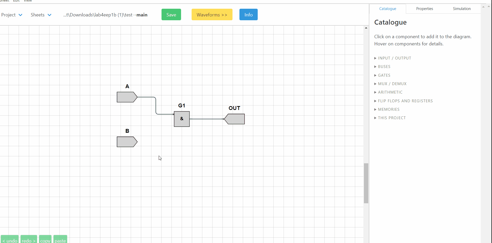

### Simulation

Time to simulate the design and see how the output `OUT` changes as we change the two inputs.

Click the `Simulation` tab which is located on the top-right corner and then `Start Simulation`. Now you can change the value of the two inputs and see how the value of the output. Try all 4 combinations of inputs: 

- A=0, B=0  
- A=0, B=1  
- A=1, B=0  
- A=1, B=1 
   
and check that the output is correct based on the truth table of the AND gate.

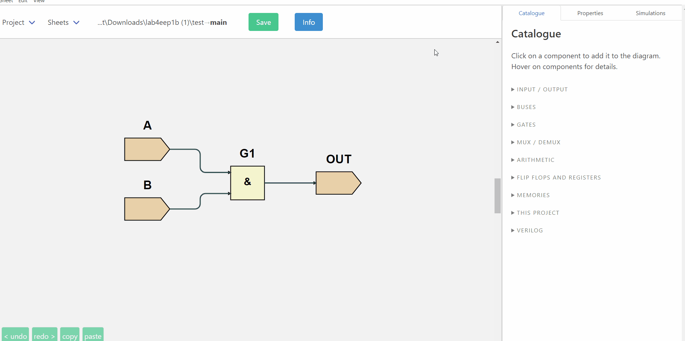

**Well Done!** You just completed your first ISSIE design.  

## Exploiting the ISSIE Features

### A slightly more complex design

This section will exploit the features of ISSIE to create clean and good-looking schematics when making bigger designs.

- Add two more inputs named `C` and `D` each 1-bit.
- Add one OR gate and one 2-input MUX
- Delete the output `OUT`
  - Note: You can delete components and/or wires by selecting them and clicking the `delete` button on your keyboard
- Add a new 1-bit output `RESULT`   
- Make all necessary connections by dragging as before to achieve a diagram like the one bellow:

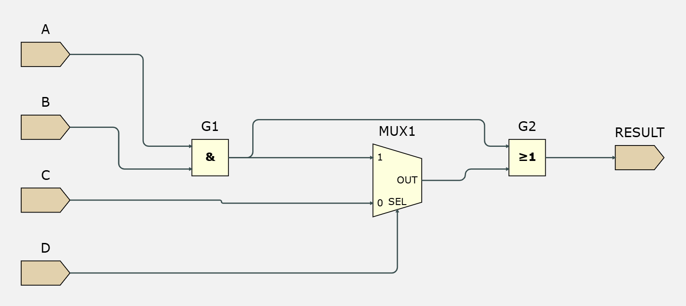

Again, **simulate the design** and check the output remains correct as you change the values of the 4 inputs

### Improving the look of a schematic

The schematic here is not easy to read. **Let's improve it!** The ISSIE canvas is fully customisable to allow the creation of readable and good-looking schematics. Specifically, we can:

1. Rotate, Flip and Move all symbols 
2. Change name and reposition the symbols' *labels* relative to the symbols
3. Manually route any specific segment in a wire
4. Auto-align elements 
5. Select the desired wire type (radiussed, jump or modern wires)

You can view the shortcuts for all these modifications on the `Edit` and `View` menus, on the
right-click menu of whatever you want to change, or all together under `Info` →
*Keyboard Shortcuts*, which lists the keys as they are on **your** platform.

**The improved schematic:**

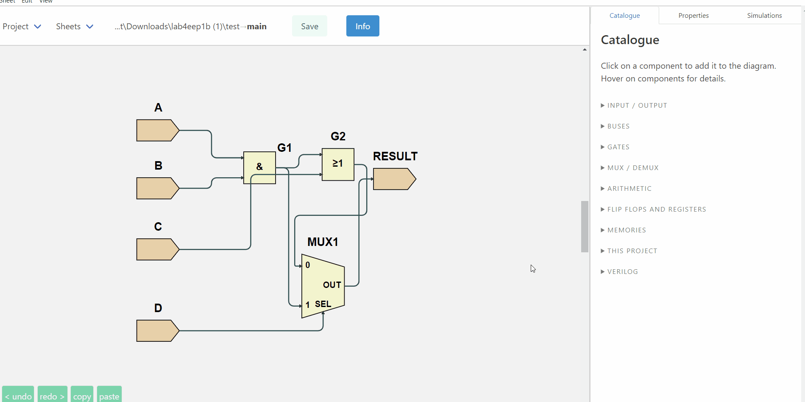

### Summary

- In the `Catalogue` Menu we can find an extensive and complete library of components (gates, flip-flops, RAMs, ROMs, n-bit registers)
- We can add any number of components in our sheet and name them as we like
- When clicking on a port, ISSIE shows us all the ports we can connect that port to: dragging from one port to another makes a wire.
- Wires are initially automatically routed, and then separated across the whole sheet so they do not sit on top of each other
- Auto-routing can be selectively over-ridden by manual routing to make a better-looking schematic. A hand-routed wire can be handed back to the router with right-click → `Unfix Wire`.
- We can simulate our design and check how the outputs change as we change the inputs.

### If something is wrong

Try starting a simulation before everything is connected. ISSIE will not just refuse: it says what
is wrong, in words aimed at someone who has not met the problem before —

> *A component input port must have precisely one driving component, but 2 were found. If you want
> to merge wires together use a MergeWires component, not direct connection.*

— highlights on the schematic exactly which components and wires are responsible, and, when the
correction is unambiguous, offers a button that makes it for you (for instance *Fix by adding 'Not
Connected' component*, which places and orients the component next to the port). Pressing it also
restarts the simulation, so you see straight away that the problem has gone.

## Using Custom Components

### The root schematic

In this section we will create a hierarchical design with multiple design sheets by using schematics as *custom symbols* in other design sheets. Here is the aim: The design we created earlier can be used in a larger design as a decoder of a 4-bit message to produce a true/false result. Therefore, we are going to create a schematic with an asynchronous-read 4-bit ROM using the schematic we created before as a *custom symbol*. 

#### Steps

1. Change the name of the current sheet from `main` to `decoder`: open the **Sheet** menu,
   right-click `main` in the design tree, and choose `Rename`
2. Add a new sheet (**Sheet** → `New Sheet`, or `Ctrl-N`) and name it `main`
3. Add to the main sheet:
   - Asynchronous ROM (`MEMORIES` => `ROM (asynchronous)`). Select 4 bits addressor, 4 bits data and the `Enter data later` option
   - Your decoder (`THIS PROJECT` => `decoder`)
   - 1-bit output named 'RESULT' (`INPUT/OUTPUT` => `Output`) 
   - 4-bit input named 'Addressor' (`INPUT/OUTPUT` => `Input`) 
4. Using 3 `SplitWire` components (`BUSES` => `SplitWire`) separate the 4-bit ROM output to 4 1-bit wires. (see image below)
5. Make the appropriate connections to achieve the schematic below

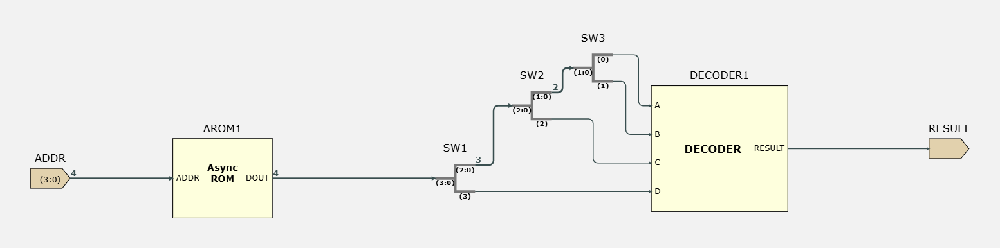

### Improving the design sheet

It's time to **move ports on custom symbols**. ISSIE allows you to re-order and change the side of
input and output ports of custom symbols by `CTRL` + `CLICKING ON THE PORT` you want to move — hold
`Ctrl` (`Cmd` on Macs) and the draggable ports and the resize corners appear. If you would rather
not remember the key, both are also on the custom component's right-click menu as *Move ports* and
*Resize symbol*.

Preview how it works in the gif below:

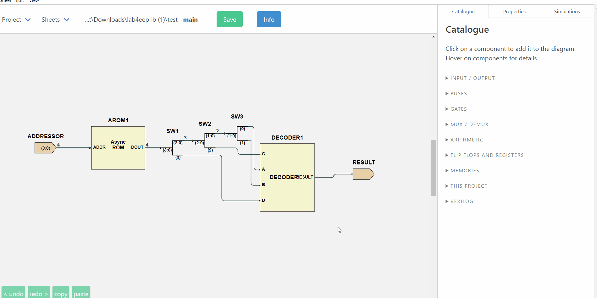

### ROM Initialisation

Currently our ROM is empty as we selected the option `Enter Data Later` before. Let's put some values in our ROM.

1. Select the ROM and click on the `Properties` tab
2. Click on `view/edit memory content`
3. Change the content of the 16 memory location available by assigning a random 4-bit number to each one
4. Click `done`

ISSIE also allows ROM and RAM initialisation via `.ram` text files of hex data in the project
directory. Each line is an address and a data word, and may carry a `//` comment — ISSIE shows the
comment against that location wherever the memory is displayed, which is what makes a program held
in a ROM readable. A `.ram` file that will not parse is reported by line and by reason, rather than
just failing to load. See the ISSIE **Eratosthenes** demo for an example. The memory component
**properties** tab offers additional options when there are `.ram` files present.

### Simulation

Simulate your design! Change the value of the addressor input and see whether your decoder produces a true or false result for each number you assigned to the ROM.

While a simulation is running — step or waveform — you can also **rest the mouse on any wire** of
the schematic to read the value it is carrying. That is usually quicker than finding the signal by
name, and it works for wires inside subsheets too.

## Waveform Simulation

### Creating a clocked design

Let's now modify our previous design to make it **clocked** (sequential). We use a counter to form a custom addressor that will increment every clock cycle. Using the waveform simulator we will be able to view the output of our circuit for all memory locations. In order to create such designs easily, ISSIE offers a `Counter` component which, starting from 0, increments by one every clock cycle. Note that counters also have options, under properties, to add `Load` or `Enable` inputs.

Add a `Counter` from the Catalogue (`FLIP FLOPS AND REGISTERS`). Now select the component and click on `Properties`. In properties remove the `load` and `enable` ports and give them the default functionality (which is what we want in this case): enable=1; load=0;

Edit the previous design to create a schematic like the one below:

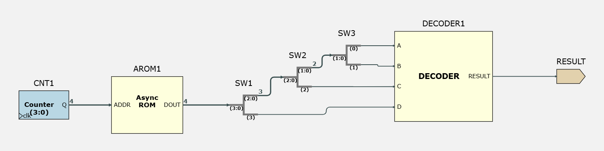

### Simulating your design

As soon as you connect everything correctly, You can simulate your design. Click on `Simulations` and then `Wave Simulation`.

- Click the `Start Simulation` button. The top sheet's own inputs and outputs are shown
  straight away, so there are already waveforms to look at.
- To choose different signals — anything on any sheet of the design, not just the top one — click
  `Select Waves`

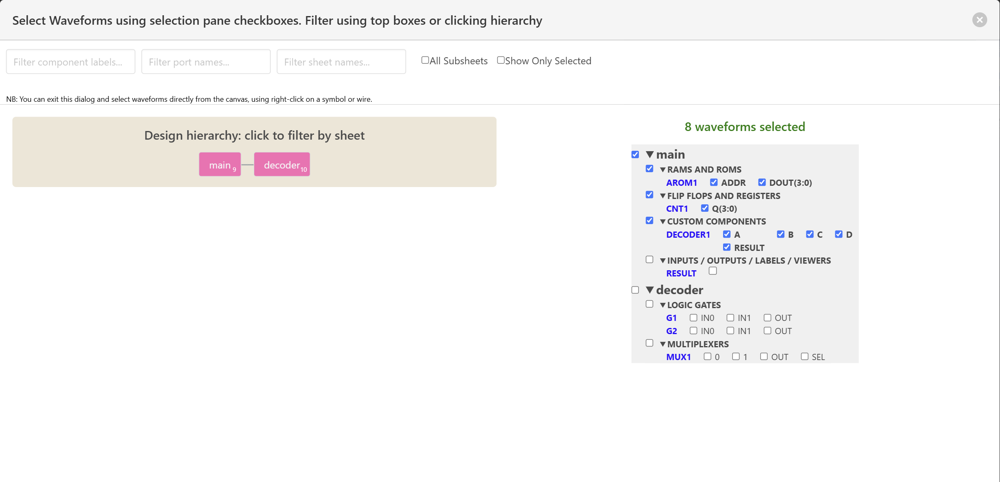

- Click the `Main` breadcrumb to filter so only main sheet ports are visible.

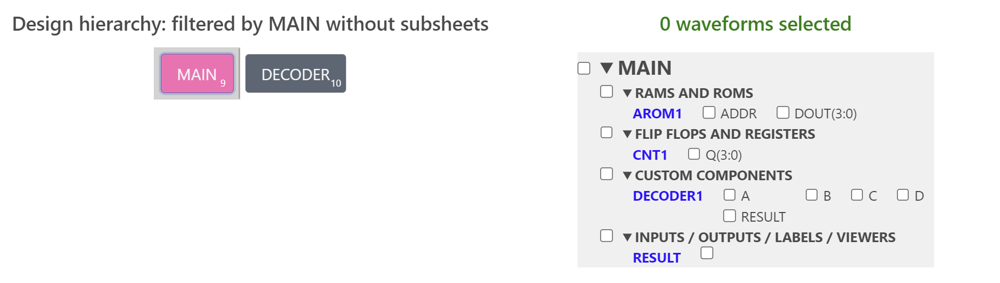

- Select:
  - `AROM1 Addr`
  - `CNT1 Q[3:0]`
  - `DECODER1  RESULT`
- Click `Done`
- To check what you have selected:
  - Click `Select waves again`
  - Click `Show only selected`
  - Click `Done`
- Use `Select RAM` to select the ROM contents to view.
- Change the data format to either `hex` or `bin` to make the waveforms more readable
- adjust the number of clock cycles displayed using the `+/-` zoom controls.
- Order the waveforms `CNT1 / AROM1 / RESULT` by dragging the waveform names up or down.
- Check that the waveform simulator output matches your previous (Step Simulation) results.
- Use the scroll bar to view additional clock cycles. Drag the thumb past the right-hand end and
  the simulation extends itself further in time.
- Drag the grey horizontal divider to make the waveform display wider or narrower (you can do this at any time).
- You can check how these features work on a much larger design with 100,000 clock cycles using the Eratosthenes sieve demo.

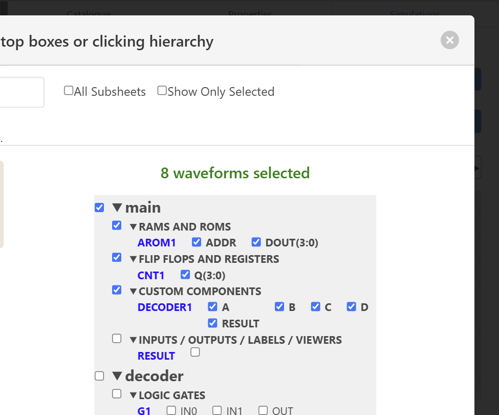

### Finding your way between the waveforms and the schematic

A waveform is not much use if you cannot tell which part of the design it came from. ISSIE keeps
the two joined up:

- **Hover a wire on the schematic** and the value it carries at the cursor cycle appears beside the
  pointer. This is the quickest way to answer "what is on that wire?" without finding the signal in
  the viewer by name.
- **Hover a waveform's name** and that component and its connections light up on the schematic.
- **Click the button beside the name** and ISSIE opens the sheet the component lives on and shows
  it to you — useful when the signal is several levels down the hierarchy.
- **Go the other way**: right-click a component on the schematic while the simulation is running
  and choose *Add waveforms to viewer* to pick which of its ports to display.
- Click a waveform to move the coloured **cursor**; the column on the right then reads out every
  selected signal's value at that cycle. `Left`/`Right` arrows step the cursor when the mouse is on
  the waveform side of the divider.
- The **Configure** button sets the waveform font size and weight, and the maximum number of cycles
  the simulation may run to, with a live estimate of the memory that will need.
- The **Info** button at the top right of the viewer explains all of this inside the app.

### Changing your design

Now, keeping the simulation open,  add an extra register between the counter and the ROM address (or make any other change you want) and check that the simulation has the expected output. You can see the changes in the waveform simulator by clicking the `Refresh` button which will be enabled as soon as there is a change in the schematic. 

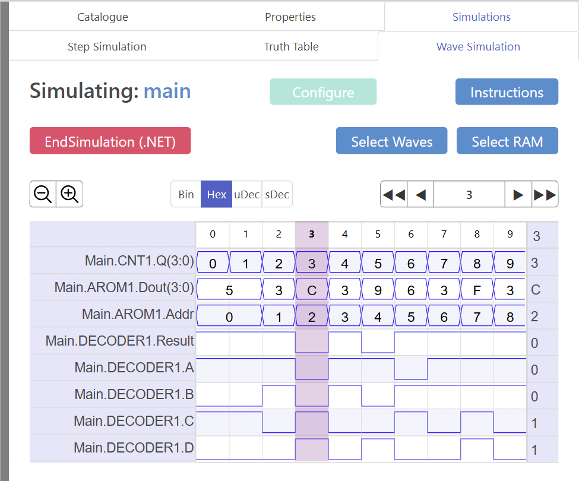

## Truth Table

One of ISSIE's features is the ability to view the truth table for a small combinational circuit. 

- Click on `Simulations` and then `Truth Table`
- Select the `DECODER` component
- Click on `Generate Truth Table` button on the 'Truth Table for selected logic' section
- Click on `Remove Redundancies`
- The truth table should look like this:

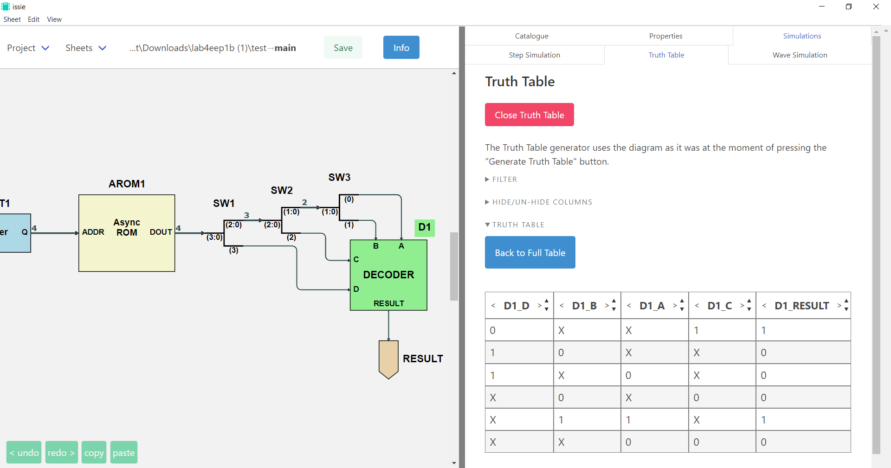

You can also select your inputs to be **algebraic values** to get an expression for each of your outputs.

- Click on `Back to full table`
- Click on `Algebra`
- Select the inputs (`C`, `B`, `A`) you want to be algebraic values
- Truth table should now look like this:

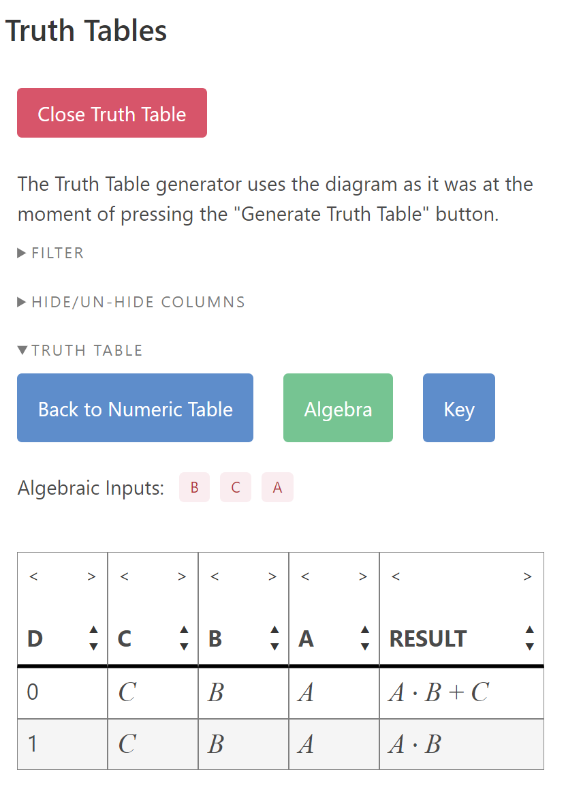

## Verilog Component

Last but not least, ISSIE allows you to create custom components by defining their logic in Verilog — combinational logic, and also synchronous logic using `always_ff @(posedge clk)`. The supported language subset is documented on the [Verilog Components](verilogComp.html) page. Click on `Verilog` -> `New Verilog Component` (Catalogue) and write the logic of your decoder in Verilog — note that port declarations need the `bit` keyword, e.g. `input bit [15:0] instr;`.

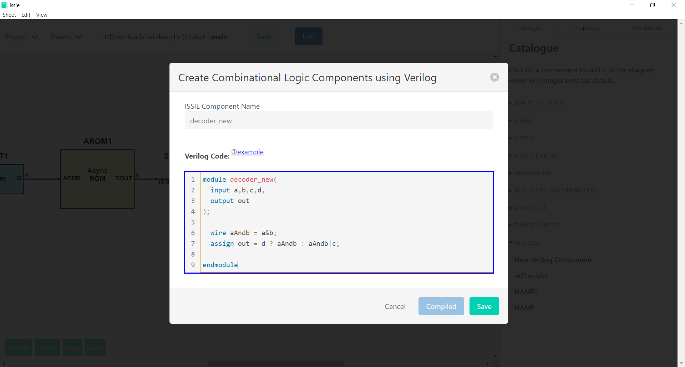

- Click `Save`
- Replace the previous Decoder with the new one (found under `Verilog` section in the Catalogue)
- Simulate again your design. Everything should be the same as before.

The editor checks your code as you type: the `Save` button stays disabled until it compiles, errors
are shown against the line that caused them, and many of them come with a one-click fix.

## Sheet Parameters

Building the same sheet twice at two different bus widths is a waste. Instead, give the sheet a
**parameter**.

- De-select everything and open the **Properties** tab. This shows the properties of the sheet
  itself rather than of a component.
- Click `Add Parameter`, give it a name (say `WIDTH`), say what it means, and give it a default
  value. The description is compulsory — the whole point is that the next person to use your sheet
  can tell what the parameter is for.
- Now, in the properties of any component on the sheet, an integer field such as a bus width or a
  constant value can be written as an expression in the parameters: `WIDTH`, `WIDTH + 1`,
  `WIDTH * 2`. The sheet is drawn at the values its parameters currently take.
- You can attach minimum and maximum constraints, each with your own wording for what a user should
  do if they violate it.

When the sheet is placed as a custom component in another sheet, ISSIE asks what values that
**instance** should use. Two instances of the same sheet may legitimately have different port
widths — a 4-bit one and a 32-bit one — and ISSIE tracks each against its own values.

The [Parameter System](parameterSystem.html) page has the full details.

## Component Libraries

The Catalogue's **Library** section holds ready-made parameterised components. Choosing one asks
for its parameter values and then copies its sheet **into your project**: it becomes an ordinary
sheet you can open, read and change, not a black box.

Any sheet you write can go the other way: right-click it in the **Sheet** menu tree and choose
`Save as library component`. You say which library to put it in — an existing one or a new name —
and what the Catalogue tooltip should say about it. Sub-sheets it uses are saved alongside it, and
are materialised with it when someone picks it.

## Now what?

You now know how to use ISSIE to create & simulate digital designs. 

You can now create your designs (from simple circuits to fully functioning CPUs) and either simulate them or extract them as Verilog to use them with other tools.

For inspiration, look when you start ISSIE under the **demos** option  for Eratosthenes Sieve demo which consists of an EEP1 CPU running an Eratosthenes Sieve program written in EEP1 assembly language. The sieve occupies most of EEP1 RAM and the program takes 200,000 clock cycles to run.